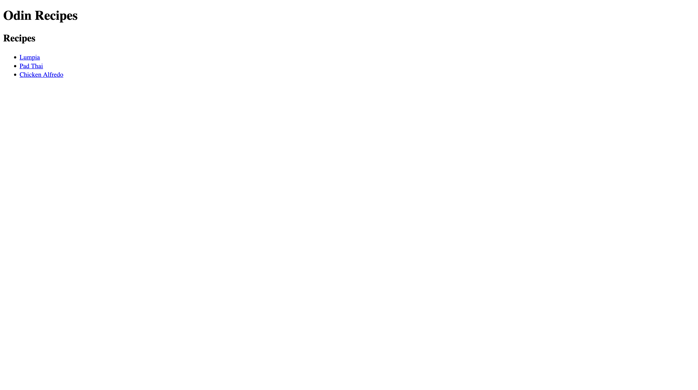
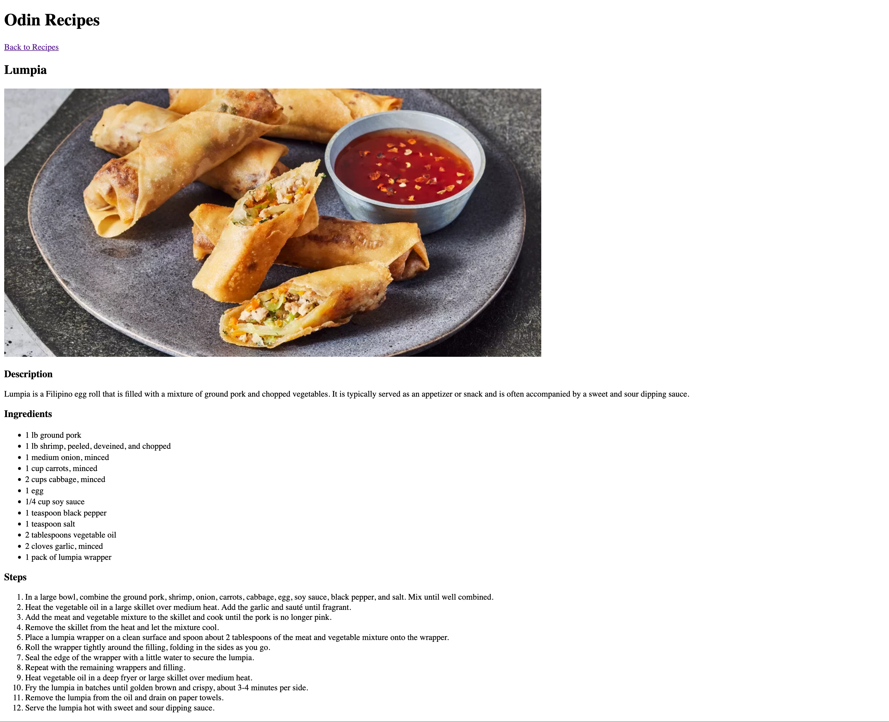

# Recipes

Page with links to a few recipes

## Assignment

This project was developed as part of the [Foundation Course](https://www.theodinproject.com/paths/foundations/courses/foundations) on The Odin Project. For more details about the assignment requirements, visit the [assignment page](https://www.theodinproject.com/lessons/foundations-recipes#project-solution).

## Technologies

- HTML5
- Git

## Features

- list of recipe links

## Screenshots

Index Page

Recipe Page

# Lessons Learned

- No new things learned
